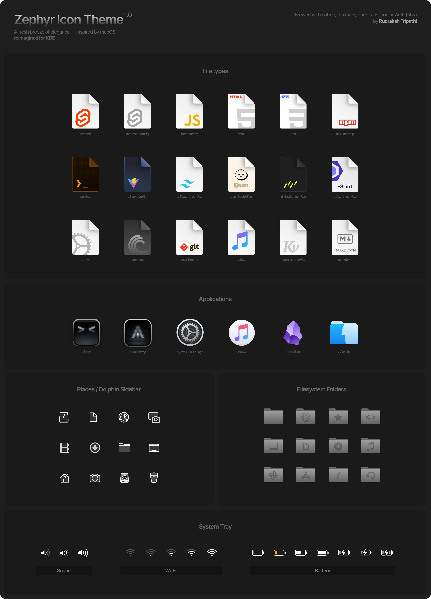

# Zephyr Icon Theme

*A fresh breeze of elegance — inspired by macOS, reimagined for KDE.*


**Zephyr** is a carefully crafted icon theme designed to bring a touch of modern elegance to your KDE setup. Inspired by macOS, but tailored for KDE Plasma, it focuses on simplicity, subtle gradients, and a touch of translucency to give your desktop a Breeze of fresh air.

This icon theme is best used as part of the full **Zephyr stack**, including:

- 🎨 **Kvantum Theme:** [Zephyr Kvantum](https://github.com/Rudraksh88/zephyr-kvantum)
- 🪟 **Window Decoration:** Personal fork of *Sierra Breeze Enhanced*
- 🎵 **MusiK Plasmoid:** A slick music player widget by yours truly, available [here](https://github.com/Rudraksh88/musik-plasmoid)
- 🔤 **UI Font:** Inter Display, with `'ss04'`, `'cv03'`, `'cv04'`, and `'cpsp'` features frozen using [FontFreeze](https://mutsuntsai.github.io/fontfreeze/)


## Preview



## 📦 Installation
1. Clone the repo:
   ```bash
   git clone https://github.com/Rudraksh88/zephyr-icons.git ~/.local/share/icons/Zephyr
   ```
2. Open System Settings > Colors & Themes > Icons and select **Zephyr** from the list.
3. Apply the theme and enjoy a fresh breeze of elegance on your desktop!

## Support
This icon theme was powered up using 100% organically-sourced, sustainably-grown coffee and a lot of late nights. If it brought you joy, consider providing a treat — coffee, snacks  and beer accepted. Donations may unlock bonus content (or at least a grin).

[](https://www.buymeacoffee.com/rudraksh.tripathi)

[](https://www.paypal.me/rudrakshtripathi)

**Only for India** UPI: `rudraksh-tripathi@ibl`

## Credits & Inspiration
This icon theme is a personal fork that has significantly diverged from its original sources. However, credit is due to the following projects and authors whose work served as the initial foundation or inspiration:

- JetBrains Icons (forked/edited): [intellij-icons.jetbrains.design](https://intellij-icons.jetbrains.design/)
- Lucide Icons (forked/edited): [lucide.dev](https://lucide.dev/)
- OSX_ONE by unc926
- zayronxio: [github.com/zayronxio/Os-Catalina-icons](https://github.com/zayronxio/Os-Catalina-icons)
- Vince Liuice <vinceliuice@hotmail.com>: [github.com/vinceliuice/WhiteSur-icon-theme](https://github.com/vinceliuice/WhiteSur-icon-theme)

## License
This icon theme is licensed under the [GPL v3](https://www.gnu.org/licenses/gpl-3.0.en.html) license. You are free to use, modify, and distribute this theme as long as you adhere to the terms of the GPL v3 license. See the [`LICENSE`](LICENSE) file for more details.
